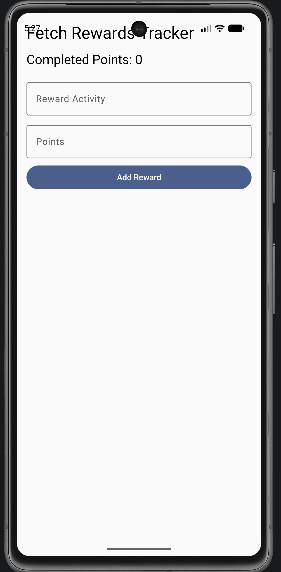
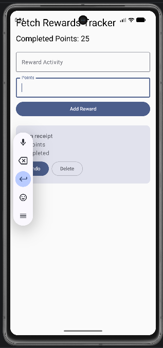

## Fetch Rewards Tracker

Fetch Rewards Tracker is an Android application build with Kotlin, 
Jetpack Compose, and MVVM architecture.The app allows users to add reward activities, 
assign point values, mark rewards as complete, and track total completed points.

## Tech Stack

-Kotlin 
-Jetpack Compose
-MVVM
-Room Database
-DAO pattern
-Repository pattern
-StateFlow
-Android Studio
-Git/GitHub

## Features

-Add reward activities
-Assign point values
-Mark rewards as complete or incomplete
-Track completed reward points
-Delete reward items
-Save rewards locally with Room persistence
-Update UI from Room data using StateFlow

## Architecture

This project follows a simple MVVM structure:

-'data' contains the RewardItem model
-'viewmodel' contains app state and business logic
-'ui' contains Jetpack Compose screens and components
-'MainActivity' connects the database, repository, ViewModel, and UI

## Why I Built This

I built this project to strengthen my Android development skill using Kotlin, 
Jetpack Compose, MVVM, Room, StateFlow, and modern mobile architecture. This 
project also demonstrates debugging, local persistence, and user-centered 
mobile development.

## Screenshots 
### Home Screen

### Rewards Added

### Completed Points

## Future Improvements
-Add Navigation Compose
-Add unit tests
-Add UI tests
-Improve styling and theme
-Add filtering for completed and active rewards
-Add reward categories

